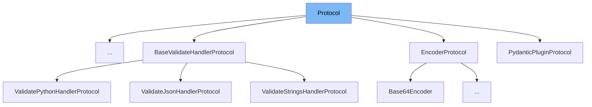

This document will cover the `Protocol` class from the `pydantic/v1/parse.py` file. We'll cover:

1. What is Protocol
2. Variables and functions in Protocol
3. Usage example of Protocol in ModelWrapValidatorWithoutInfo.



# What is Protocol

The `Protocol` class in `pydantic/v1/parse.py` is an enumeration that represents the type of protocol used for data serialization and deserialization. It has two values: `json` and `pickle`, representing JSON and Pickle protocols respectively.

<SwmSnippet path="/pydantic/v1/parse.py" line="10">

---

# Variables and functions

The `Protocol` class has two variables: `json` and `pickle`. These variables represent the two types of protocols that can be used.

```python
class Protocol(str, Enum):
    json = 'json'
    pickle = 'pickle'
```

---

</SwmSnippet>

<SwmSnippet path="/pydantic/v1/parse.py" line="15">

---

The `load_str_bytes` function is used to load and deserialize data. It uses the `Protocol` enumeration to determine the protocol to use for deserialization.

```python
def load_str_bytes(
    b: StrBytes,
    *,
    content_type: str = None,
    encoding: str = 'utf8',
    proto: Protocol = None,
    allow_pickle: bool = False,
    json_loads: Callable[[str], Any] = json.loads,
) -> Any:
    if proto is None and content_type:
        if content_type.endswith(('json', 'javascript')):
            pass
        elif allow_pickle and content_type.endswith('pickle'):
            proto = Protocol.pickle
        else:
            raise TypeError(f'Unknown content-type: {content_type}')

    proto = proto or Protocol.json

    if proto == Protocol.json:
        if isinstance(b, bytes):
```

---

</SwmSnippet>

<SwmSnippet path="/pydantic/v1/parse.py" line="47">

---

The `load_file` function is used to load and deserialize data from a file. It uses the `Protocol` enumeration to determine the protocol to use for deserialization.

```python
def load_file(
    path: Union[str, Path],
    *,
    content_type: str = None,
    encoding: str = 'utf8',
    proto: Protocol = None,
    allow_pickle: bool = False,
    json_loads: Callable[[str], Any] = json.loads,
) -> Any:
    path = Path(path)
    b = path.read_bytes()
    if content_type is None:
        if path.suffix in ('.js', '.json'):
            proto = Protocol.json
        elif path.suffix == '.pkl':
            proto = Protocol.pickle

    return load_str_bytes(
        b, proto=proto, content_type=content_type, encoding=encoding, allow_pickle=allow_pickle, json_loads=json_loads
    )
```

---

</SwmSnippet>

<SwmSnippet path="/pydantic/functional_validators.py" line="1">

---

# Usage example

The `Protocol` class is used in the `ModelWrapValidatorWithoutInfo` class. It is used to determine the protocol for deserialization of data.

```python
"""This module contains related classes and functions for validation."""

from __future__ import annotations as _annotations

import dataclasses
import sys
from functools import partialmethod
from types import FunctionType
from typing import TYPE_CHECKING, Any, Callable, TypeVar, Union, cast, overload

from pydantic_core import core_schema
from pydantic_core import core_schema as _core_schema
from typing_extensions import Annotated, Literal, TypeAlias

from . import GetCoreSchemaHandler as _GetCoreSchemaHandler
from ._internal import _core_metadata, _decorators, _generics, _internal_dataclass
from .annotated_handlers import GetCoreSchemaHandler
from .errors import PydanticUserError

if sys.version_info < (3, 11):
    from typing_extensions import Protocol
```

---

</SwmSnippet>

&nbsp;

*This is an auto-generated document by Swimm AI 🌊 and has not yet been verified by a human*

<SwmMeta version="3.0.0" repo-id="Z2l0aHViJTNBJTNBREVNTy1weWRhbnRpYyUzQSUzQWdpbGFkbmF2b3Q=" repo-name="DEMO-pydantic" doc-type="class"><sup>Powered by [Swimm](/)</sup></SwmMeta>
