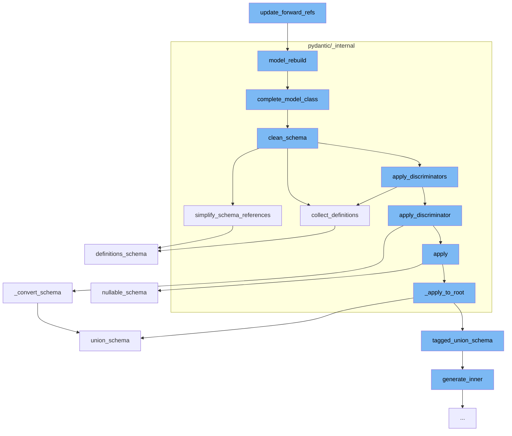

This document will cover the process of updating forward references in the Pydantic library, which includes:

1. Rebuilding the model
2. Completing the model class
3. Cleaning the schema
4. Simplifying schema references
5. Collecting definitions
6. Applying discriminators
7. Converting the schema



<SwmSnippet path="/pydantic/main.py" line="487">

---

# Rebuilding the model

The function <SwmToken path="/pydantic/main.py" pos="487:3:3" line-data="    def model_rebuild(">`model_rebuild`</SwmToken> is used to rebuild the <SwmToken path="/pydantic/main.py" pos="495:12:14" line-data="        &quot;&quot;&quot;Try to rebuild the pydantic-core schema for the model.">`pydantic-core`</SwmToken> schema for the model. This is necessary when one of the annotations is a <SwmToken path="/pydantic/main.py" pos="497:23:23" line-data="        This may be necessary when one of the annotations is a ForwardRef which could not be resolved during">`ForwardRef`</SwmToken> which could not be resolved during the initial attempt to build the schema, and automatic rebuilding fails.

```python
    def model_rebuild(
        cls,
        *,
        force: bool = False,
        raise_errors: bool = True,
        _parent_namespace_depth: int = 2,
        _types_namespace: dict[str, Any] | None = None,
    ) -> bool | None:
        """Try to rebuild the pydantic-core schema for the model.

        This may be necessary when one of the annotations is a ForwardRef which could not be resolved during
        the initial attempt to build the schema, and automatic rebuilding fails.

        Args:
            force: Whether to force the rebuilding of the model schema, defaults to `False`.
            raise_errors: Whether to raise errors, defaults to `True`.
            _parent_namespace_depth: The depth level of the parent namespace, defaults to 2.
            _types_namespace: The types namespace, defaults to `None`.

        Returns:
            Returns `None` if the schema is already "complete" and rebuilding was not required.
```

---

</SwmSnippet>

<SwmSnippet path="/pydantic/_internal/_model_construction.py" line="487">

---

# Completing the model class

The function <SwmToken path="/pydantic/_internal/_model_construction.py" pos="487:2:2" line-data="def complete_model_class(">`complete_model_class`</SwmToken> is used to finish building a model class. This logic must be called after class has been created since validation functions must be bound and <SwmToken path="/pydantic/_internal/_model_construction.py" pos="499:4:4" line-data="    and `get_type_hints` requires a class object.">`get_type_hints`</SwmToken> requires a class object.

```python
def complete_model_class(
    cls: type[BaseModel],
    cls_name: str,
    config_wrapper: ConfigWrapper,
    *,
    raise_errors: bool = True,
    types_namespace: dict[str, Any] | None,
    create_model_module: str | None = None,
) -> bool:
    """Finish building a model class.

    This logic must be called after class has been created since validation functions must be bound
    and `get_type_hints` requires a class object.

    Args:
        cls: BaseModel or dataclass.
        cls_name: The model or dataclass name.
        config_wrapper: The config wrapper instance.
        raise_errors: Whether to raise errors.
        types_namespace: Optional extra namespace to look for types in.
        create_model_module: The module of the class to be created, if created by `create_model`.
```

---

</SwmSnippet>

<SwmSnippet path="/pydantic/_internal/_generate_schema.py" line="446">

---

# Cleaning the schema

The function <SwmToken path="/pydantic/_internal/_generate_schema.py" pos="446:3:3" line-data="    def clean_schema(self, schema: CoreSchema) -&gt; CoreSchema:">`clean_schema`</SwmToken> is used to clean the schema. It collects definitions, simplifies schema references, and applies discriminators to the schema.

```python
    def clean_schema(self, schema: CoreSchema) -> CoreSchema:
        schema = self.collect_definitions(schema)
        schema = simplify_schema_references(schema)
        if collect_invalid_schemas(schema):
            raise self.CollectedInvalid()
        schema = _discriminated_union.apply_discriminators(schema)
        schema = validate_core_schema(schema)
        return schema
```

---

</SwmSnippet>

<SwmSnippet path="/pydantic/_internal/_core_utils.py" line="417">

---

# Simplifying schema references

The function <SwmToken path="/pydantic/_internal/_core_utils.py" pos="417:2:2" line-data="def simplify_schema_references(schema: core_schema.CoreSchema) -&gt; core_schema.CoreSchema:  # noqa: C901">`simplify_schema_references`</SwmToken> is used to simplify schema references. It collects references, counts references, and inlines references.

```python
def simplify_schema_references(schema: core_schema.CoreSchema) -> core_schema.CoreSchema:  # noqa: C901
    definitions: dict[str, core_schema.CoreSchema] = {}
    ref_counts: dict[str, int] = defaultdict(int)
    involved_in_recursion: dict[str, bool] = {}
    current_recursion_ref_count: dict[str, int] = defaultdict(int)

    def collect_refs(s: core_schema.CoreSchema, recurse: Recurse) -> core_schema.CoreSchema:
        if s['type'] == 'definitions':
            for definition in s['definitions']:
                ref = get_ref(definition)
                assert ref is not None
                if ref not in definitions:
                    definitions[ref] = definition
                recurse(definition, collect_refs)
            return recurse(s['schema'], collect_refs)
        else:
            ref = get_ref(s)
            if ref is not None:
                new = recurse(s, collect_refs)
                new_ref = get_ref(new)
                if new_ref:
```

---

</SwmSnippet>

<SwmSnippet path="/pydantic/_internal/_generate_schema.py" line="455">

---

# Collecting definitions

The function <SwmToken path="/pydantic/_internal/_generate_schema.py" pos="455:3:3" line-data="    def collect_definitions(self, schema: CoreSchema) -&gt; CoreSchema:">`collect_definitions`</SwmToken> is used to collect definitions in the schema. It checks if the schema has a reference and if so, it adds it to the definitions.

```python
    def collect_definitions(self, schema: CoreSchema) -> CoreSchema:
        ref = cast('str | None', schema.get('ref', None))
        if ref:
            self.defs.definitions[ref] = schema
        if 'ref' in schema:
            schema = core_schema.definition_reference_schema(schema['ref'])
        return core_schema.definitions_schema(
            schema,
            list(self.defs.definitions.values()),
        )
```

---

</SwmSnippet>

<SwmSnippet path="/pydantic/_internal/_discriminated_union.py" line="2">

---

# Applying discriminators

The function <SwmToken path="/pydantic/types.py" pos="2835:3:3" line-data="    def _convert_schema(self, original_schema: core_schema.CoreSchema) -&gt; core_schema.TaggedUnionSchema:">`_convert_schema`</SwmToken> is used to convert the schema. It checks if the schema is a union and if so, it generates a tagged union schema.

```python

```

---

</SwmSnippet>

&nbsp;

*This is an auto-generated document by Swimm AI 🌊 and has not yet been verified by a human*

<SwmMeta version="3.0.0" repo-id="Z2l0aHViJTNBJTNBREVNTy1weWRhbnRpYyUzQSUzQWdpbGFkbmF2b3Q=" repo-name="DEMO-pydantic"><sup>Powered by [Swimm](https://app.swimm.io/)</sup></SwmMeta>
